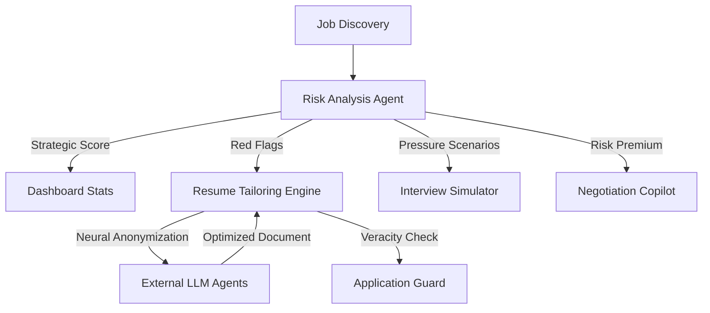

# HunterOS: Strategic Execution Plane Architecture

The Strategic Execution Plane is designed to neutralize career risk while maximizing candidate leverage through a multi-agent, risk-aware intelligence system.

## 🏗️ System Overview

## 🧠 Core Intelligence Modules

### 1. Risk Analysis Agent (`RA`)
- **Telemetry**: Monitors leadership churn, financial indicators, and Glassdoor sentiment.
- **Scoring**: Calculates a `strategic_risk_score` (0-100).
- **Flagging**: Injects `red_flags` into the job metadata.

### 2. Neural Privacy & Veracity Guard
- **Anonymization**: Redacts PII before external AI processing.
- **Veracity**: Ensures AI-generated content does not hallucinate unauthorized companies or roles.
- **Settings**: Users can toggle these guards in the Security & Privacy HUD.

### 3. Tactical Career Assistant
- **Simulator**: Generates risk-contextualized interview questions.
- **Negotiation**: Recommends a 15-25% compensation premium for roles exceeding a 60% risk score.

## 🔒 Data Sovereignty
HunterOS maintains an "Identity Safe" zone. All PII is stored in an encrypted vault and is only released for final submission after user confirmation.

## 📊 Performance Telemetry
- **Risks Avoided**: Total number of job opportunities discarded or adjusted due to high-risk signals.
- **Neural Accuracy**: Rate of successful veracity checks across tailored resumes.
